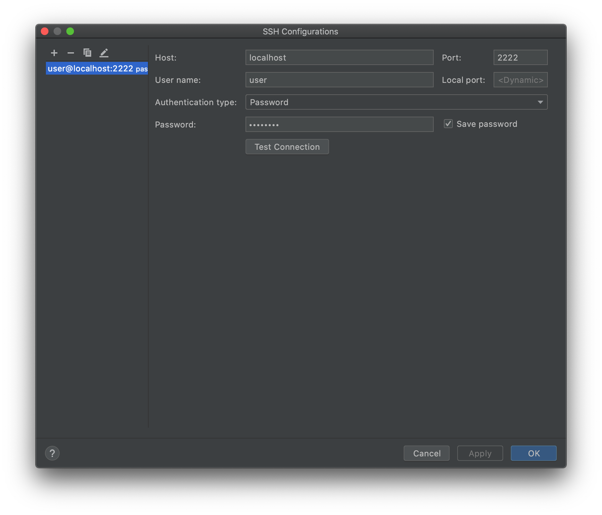
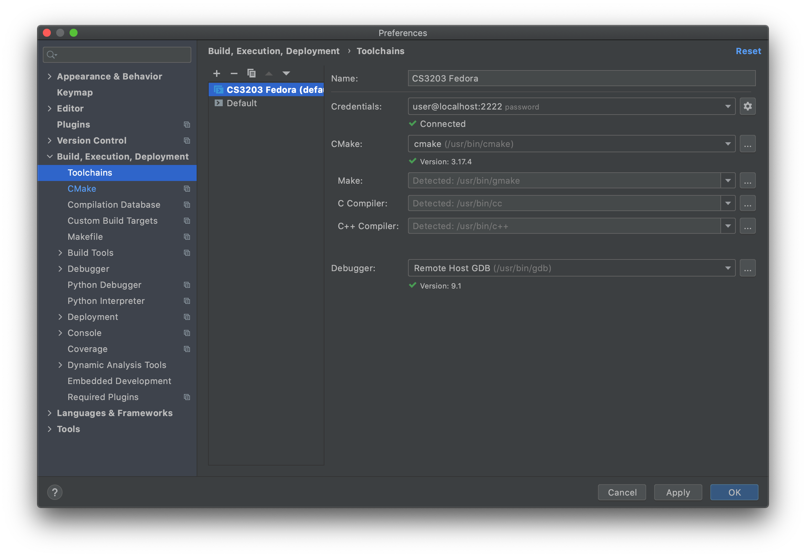
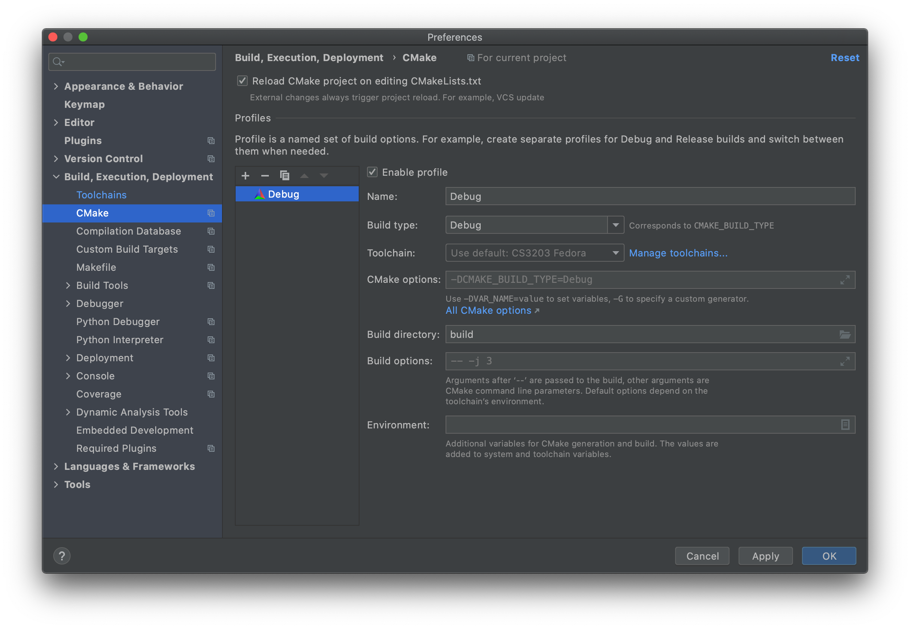
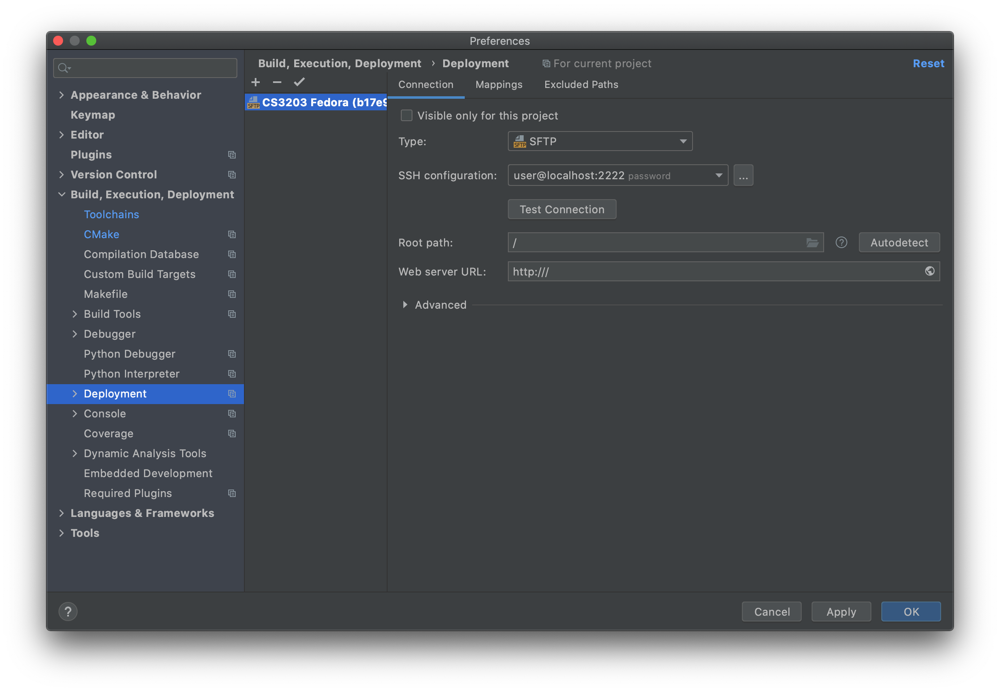
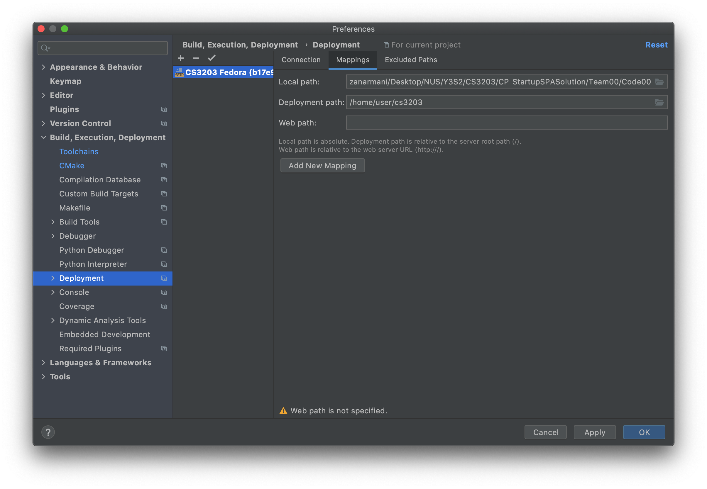
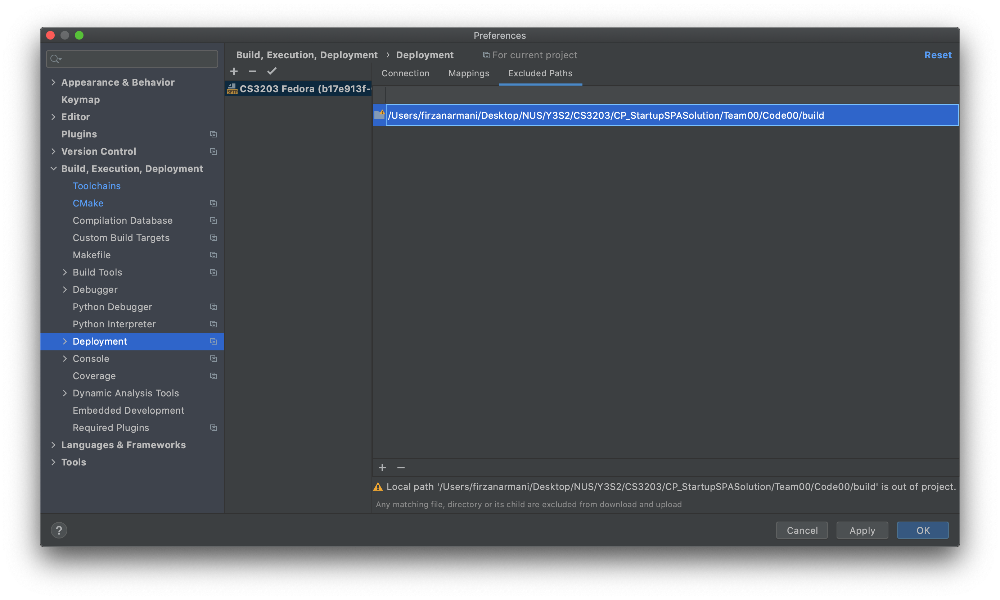
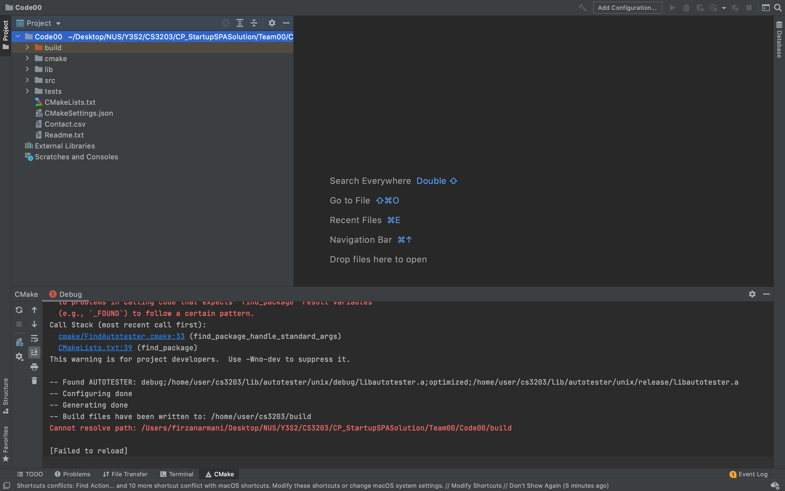

# Fedora Docker Container for CS3203 Cross-Platform SPA Development
This repository provides a Dockerfile to allow you to build (and tweak) a Fedora Linux Docker container for cross-platform development of CS3203's Static Program Analyzer.

The target environment for builds is Fedora 32.

This Docker container is also set up for remote toolchain integration with CLion.

## Getting Started
1. Ensure that you have [Docker](https://docs.docker.com/get-docker/) installed on your system.
2. Build the Docker image using the Dockerfile with:
   ```
   docker build -t cs3203/fedora-dev-env -f Dockerfile.cs3203-dev .
   ```
3. Create and run the container (for the first time) using the built image with:
   - If you intend to simply use it as a target build environment (or you're developing in Visual Studio or others)
     ```
     docker run -d --cap-add sys_ptrace --mount type=bind,source=<PathToCodeDirectory>,target=/home/user/cs3203  --name fedora-dev-env cs3203/fedora-dev-env
     ```
     - Note that for Linux or MacOS systems, the `<PathToCodeDirectory>` can use the `$(pwd)` subcommand for the current working directory as in:
       ```
       ...,source="$(pwd)"/CS3203/Team06/Code06,...
       ```
       but for Windows systems, the `<PathToCodeDirectory>` should be an absolute path as in:
       ```
       ...,source=c:\CS3203\Team06\Code06,... 
       ```
   - If you intend to develop in CLion using the Full Remote Mode
     ```
     docker run -d --cap-add sys_ptrace -p127.0.0.1:2222:22 --name fedora-dev-env cs3203/fedora-dev-env
     ```

   Note: It's also a good idea to remove [localhosts]:2222 if it exists in your system's SSH known_hosts file. The following command tries to find an entry and removes it if it exists:
   ```
   ssh-keygen -f "$HOME/.ssh/known_hosts" -R "[localhost]:2222"
   ```
4. After you're done, stop the container with:
   ```
   docker stop fedora-dev-env
   ```
5. Subsequently after the first run, start the stopped container with:
   ```
   docker start fedora-dev-env
   ```
> To attach a terminal session to the container, you can do so with:
> ```
> docker exec -it fedora-dev-env /bin/bash
> ```
> This can also be done in the Docker Desktop application.

## Using as a Target Build Environment in CLI
1. Ensure that the `fedora-dev-env` container is running.
2. Open the CLI for the container in the Docker Desktop application or start a new terminal session and run `docker exec -it fedora-dev-env /bin/bash` to attach to the container's CLI.
3. Navigate to the target folder specified during `docker run`, i.e. `cd /home/user/cs3203` and ensure that the source folder has been properly bind-mounted.
4. Carry on build instructions as per the CS3203 Wiki guide [here](https://github.com/nus-cs3203/project-wiki/wiki/Cross-platform-Startup-SPA-Solution#25-working-on-fedora-32-linux-using-terminal)

## Full Remote Mode with CLion
1. Ensure that the `fedora-dev-env` container is running.
2. In CLion, navigate to your project folder and open the top-level CMakeLists.txt using `Open as Project`
3. In `Preferences > Build, Execution, Deployment > Toolchain`, add a new `Remote Host` and set the credentials to
   - Host: `localhost`
   - Port: `2222`
   - User name: `user`
   - Authentication type: `Password`
   - Password: `password`

    

   and click `Test Connection` to ensure that the connection to the Docker container works. Once done correctly, CLion should be able to detect the tools' versions and path on the Fedora container.
   
4. In `Preferences > Build, Execution, Deployment > CMake`, ensure that in the profile, 
   
   - Toolchain: Fedora toolchain made in step 3 (especially if the toolchain was not set to the default one)
   - Build directory: `build` (as per CS3203 SPA build instructions, but can be changed to your own preference)
5. In `Preferences > Build, Execution, Deployment > Deployment`, ensure the following settings for the deployment server (create a new SFTP server if it doesn't exist)
   - Under `Connection` tab:
   
      - Type: `SFTP`
      - SSH configuration: (same as toolchain)
      - Root path: preferably `\` but can be set to your own preference
   - Under `Mappings` tab:
   
      - Local path: (current project path)
      - Deployment path: (specify a path for your project preferably somewhere in `/home/user`)
   - Under `Excluded Paths` tab:
   
      - `Local path` pointing to the `build directory` specified in step 4
        - Note that this will show a `...\<path>... is out of project` warning. You can ignore this warning.
6. Close the Preferences window by click on the `OK` button. CMake should automatically reload the project using these new settings. If it does not, go to `File > Reload CMake Project`.
> You may encounter the following error in reloading the CMake project: `Cannot resolve path: \<build directory>`\
> 
> This is a bug that has been raised to the CLion developers as seen [here](https://youtrack.jetbrains.com/issue/CPP-23652). To work around this:
> - Go to `Help > Find Actions` and enter `Registry`
> - In the `Registry` window, uncheck the registry `clion.remote.sync.text.files` and close the window
> - Go to `File > Invalidate Caches / Restart` and select `Invalidate and Restart`
> - Once CLion restarts, CMake build should run automatically and the bug should be fixed
7. Build configurations are now automatically added as seen in the top right of the window.

## References
- https://github.com/nus-cs3203/project-wiki/wiki/Cross-platform-Startup-SPA-Solution
- https://www.jetbrains.com/help/clion/remote-projects-support.html
- https://www.jetbrains.com/help/clion/clion-toolchains-in-docker.html
- https://github.com/JetBrains/clion-remote/blob/master/Dockerfile.centos7-cpp-env